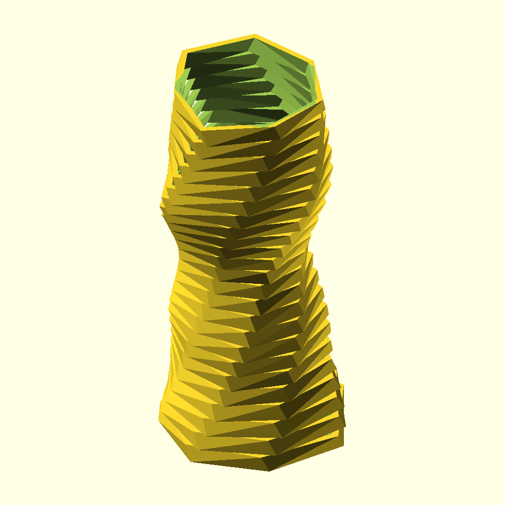

<p align="center">
  
  
  
  
  
  
</p>

<p align="center">
  <b>PolyForge takes a description, a set of measurements, or an existing model and turns it into an editable, validated, 3D-printable CAD file.</b> Standalone, with no agent involved, or as a skill for whatever LLM you already use.
</p>

---

### Contents

- [Why I built this](#why-i-built-this)
- [What it does today](#what-it-does-today)
- [Roadmap](#roadmap)
- [Install](#install)
- [Usage](#usage)
- [Architecture](#architecture)
- [Layout](#layout)
- [Contributing](#contributing)
- [Author](#author)

## Why I built this

I originally put this together as a ChatGPT skill, just for OpenSCAD, so I could describe a bracket or an enclosure and get back something I could actually print on my modified Ender 3 V2 or my QALAM Pro 400, instead of hand-modeling every mount and shelf myself. It worked fine, but it only worked in ChatGPT, and it needed an agent (and an API bill) in the loop even for a plain shelf bracket. That felt backwards. A shelf doesn't need a language model to exist.

So I pulled it apart and rebuilt it as PolyForge. The part that turns a description into a common shape now runs completely on its own, no agent, no LLM, nothing. The richer part, the one that can reconstruct a busted STL or design something genuinely custom, is still an agent workflow, but it's no longer tied to one platform. Point Claude Code, ChatGPT, Gemini, or a local model at it and it works the same way, because the actual capability lives in a standalone Python package, not in something only one vendor's assistant knows how to run.

## What it does today

**Standalone, no LLM required.** A small library of parametric part templates, box, wall shelf, corner bracket, cable comb, standoff mount plate, general parametric vase/planter, each one filled in from plain text by keyword matching and regex extraction (dimensions, screw sizes, hole counts), then rendered to any of three CAD backends:

```bash
polyforge design "a wall shelf 200x150x5mm with 2 M4 holes"                    # writes a .scad
polyforge design "a wall shelf 200x150x5mm with 2 M4 holes" --backend freecad  # writes a .FCMacro
polyforge design "a wall shelf 200x150x5mm with 2 M4 holes" --backend blender # writes a .blender.py
```

Every template is unit-tested and also compile-tested against the real `openscad`, `freecadcmd`, and `blender` binaries, with all three backends' output checked to match dimensionally. See [`tests/`](tests) if you want to see that for yourself.

**Agent-driven**, for everything a template can't cover. The full [`SKILL.md`](.claude/skills/polyforge/SKILL.md) workflow: create, understand, modify, reconstruct from an STL, repair a mesh, export, publish, plus printer-aware fit checks for a modified Ender 3 V2, a QALAM Pro 400, or a generic FDM profile. See [`references/printer-profiles.md`](.claude/skills/polyforge/references/printer-profiles.md) and [`references/design-and-repair.md`](.claude/skills/polyforge/references/design-and-repair.md).

**An optional local-model engine.** `--engine llm` asks a local model (Ollama by default) to fill in the same templates from more casual phrasing. Still fully offline, still limited to the shapes the template library actually knows. The Ollama server itself is managed for you: `polyforge ollama-status` (or `design --engine llm` directly) detects whether it's installed, checks whether it's already running, starts `ollama serve` automatically if not, and lists whichever models you've actually pulled -- no hardcoded model name to fall out of date with what's installed on a given machine.

**A local web GUI.** `polyforge gui` starts a small local server (Python's own `http.server`, no Flask/FastAPI, same zero-dependency ethos as the rest of the standalone core) and opens your browser to a form: Ollama status, a design box with live template/param results, per-param editing and regeneration, the seven-view preview, and STL export -- the same calls the CLI makes, just with a UI instead of flags.

**Photos in, mesh out.** `polyforge reconstruct-from-photos` turns a directory of overlapping photos of a real object into an STL, fully offline: COLMAP for structure-from-motion, handed off to OpenMVS for the dense reconstruction and meshing (COLMAP's own dense stage is CUDA-only with no CPU path, confirmed directly, not assumed). The result is reconstructed evidence, not editable parametric source, and it has no absolute real-world scale until you measure and rescale it against something known, same as any photogrammetry output.

## Roadmap

I'm building this one phase at a time, each on its own branch, tested before it merges into main.

- [x] **Phase 1, standalone offline CLI core.** Template library, the zero-ML text matcher, the optional local-LLM matcher, OpenSCAD preview/export, STL inspection, mesh repair.
- [x] **Phase 2, FreeCAD export backend.** A second parametric target through FreeCAD's headless Python API (`freecadcmd`), producing an editable `.FCMacro` plus STEP/STL export. No multi-view preview for it yet, that needs FreeCAD's GUI/OpenGL stack, not just the console CLI, so use `export` for a validated STL/STEP instead.
- [x] **Phase 3, Blender export backend.** A third target through Blender's headless Python API (`bpy`/`bmesh`), producing an editable `.blender.py` plus STL export (mesh-only, Blender has no B-rep kernel so there's no STEP output here). Same no-preview caveat as FreeCAD, same reason, use `export` instead.
- [x] **Phase 4, image-to-3D.** Multi-photo photogrammetry, fully offline: COLMAP for sparse structure-from-motion, handed off to OpenMVS for CPU-capable dense reconstruction and meshing (COLMAP's own dense stage is CUDA-only, no CPU fallback, confirmed by deliberately crashing it). Feeds into the existing reconstruct-from-STL workflow: treat the result as evidence to measure and rebuild from, not editable source, and note it has no absolute scale until rescaled against a known real-world measurement.
- [x] **Phase 5, a general parametric vase/planter generator.** 4 independently-shaped profile sections (cylinder, cone, eased taper, or bulge/hourglass), an optional low-poly faceted look (or smooth, with `num_sides` high and `facet_jitter` at 0), spiral twist, an optional holder ring, and an optional textured base, across all three backends (OpenSCAD/FreeCAD/Blender). `polyforge design "a low poly vase"`. A revolved-profile generator (this one, and every site it was researched against) can only ever produce shapes symmetric around the vertical axis -- a literal creature or skull silhouette needs real generative 3D synthesis, a different technology entirely.

If a box above isn't checked, that feature isn't built yet. Don't take my word for it either, go read the code.

## Install

**Installer scripts (Linux and Windows)**, if you'd rather not run the steps below by hand: they create a virtualenv (asks first), install polyforge, check for OpenSCAD, detect your GPU (NVIDIA/CUDA or AMD/ROCm) and recommend an Ollama model size to match, and can install Ollama + pull that model (asks first for both -- one runs a remote installer, the other downloads several GB).

```bash
git clone https://github.com/rx290/polyforge.git && cd polyforge
./scripts/install.sh          # Linux -- add --yes to skip every prompt (CI/unattended)
```

```powershell
git clone https://github.com/rx290/polyforge.git; cd polyforge
.\scripts\install.bat         # Windows -- double-click it, or run install.ps1 directly; add -Yes to skip prompts
```

The GPU-detection/model-recommendation logic (`polyforge hardware-scan`) is itself a normal, tested part of the package -- the installer scripts are thin bootstrap wrappers around it, not where the actual logic lives. The Linux script has been run end to end in this repo's own dev environment; the Windows one has been written and reasoned through carefully but not yet executed on a real Windows machine -- report anything that doesn't work as written.

**Standalone CLI, works anywhere, no agent needed** (what the installer scripts above actually automate):

```bash
git clone https://github.com/rx290/polyforge.git
cd polyforge
pip install -e .              # add [repair] for mesh repair: pip install -e .[repair]
polyforge list-templates
```

**Claude Code:**

```bash
cp -r polyforge/.claude/skills/polyforge ~/.claude/skills/   # or into <project>/.claude/skills/
```

**ChatGPT / Codex:** ships [`agents/openai.yaml`](.claude/skills/polyforge/agents/openai.yaml) for native registration.

**Gemini, Kimi K2, other tool-calling models, or a bare LLM with no tool-calling:** see [`AGENTS.md`](AGENTS.md).

**Tooling you'll need for rendering, export, and repair:**

```bash
sudo apt install openscad   # or brew install openscad, or grab it from openscad.org: needed for preview/export
sudo apt install freecad    # or brew install freecad, or freecad.org: needed for --backend freecad export
sudo apt install blender    # or brew install blender, or blender.org: needed for --backend blender export
python3 -m pip install trimesh   # optional, only for mesh repair
```

**For `reconstruct-from-photos`**, you need COLMAP and OpenMVS. Neither ships in most distros' official repos; on Arch/Manjaro they're AUR-only (`colmap`, `openmvs`) and, depending on how current your system's OpenCV/vcpkg are relative to when those packages were last updated, may need a couple of small source patches to build (nothing polyforge-specific, just AUR-package staleness against a rolling-release system) -- see the comments at the top of [`geometry/photogrammetry.py`](src/polyforge/geometry/photogrammetry.py) for what to expect. Build CPU-only (`BUILD_CUDA=OFF`) unless you actually have a CUDA toolchain: COLMAP's dense stage needs CUDA either way (there's no CPU path in the mainline binary at all), which is exactly why this pipeline routes dense reconstruction through OpenMVS instead.

`design`, `list-templates`, and STL `inspect` don't need anything beyond the Python standard library.

## Usage



`polyforge design "a low poly twisted vase"` -- generated headlessly (`scripts/demo_vase.sh` reproduces this exact image via `polyforge design` + `polyforge preview`, no GUI or manual screenshot involved).

### Vase text-to-shape vocabulary

The vase template's free text does more than just pick the template -- it also fills in the section/ring/texture params, so plain-English requests actually change the generated shape instead of always rendering the same defaults.

**Dimensions**, either order, `mm`/`cm`/`in` all understood (`mm` assumed if you leave the unit off):
- `height` / `tall` -> overall height
- `width` / `wide` / `diameter` / `diam` -> base diameter

**Shape keywords:**

| say this | ...and you get |
|---|---|
| `wave ripples`, `wavy`, `ripples`, `textured` | a repeating wave texture near the base |
| `hourglass`, `waist`, `pinched` | a pinched-in bulge near the bottom |
| `bulb`, `globe`, `dome`, `round top` | a bulging-out section near the top |
| `plain neck`, `simple neck`, `straight neck` | a straight cylindrical middle section |
| `holder ring`, `finger ring`, `bulb holder` | a raised ring near the rim (e.g. to seat a bulb-holder fitting) |
| `twist`, `twisted`, `spiral`, `helix` | a full 360 degree spiral from base to rim |
| `low poly`, `faceted`, `angular` | a chunky, visibly-faceted look |
| `smooth`, `rounded` | a near-smooth body (high facet count, no jitter) |
| `detailed`, `fine detail`, `high resolution` | a more finely sampled curve (higher `profile_slices`) |
| `without support`, `no support(s)`, `support-free` | forces every section to taper the same or narrower than the one below it (never flares outward), and turns off any bulge section -- the whole vase prints standing up with no overhangs to bridge |

Sample prompts to try (`polyforge design "<text>"`, or the GUI's Design box):

```
a vase 250mm height and 90mm diameter
a vase with wave ripples
an hourglass vase
a vase with a bulb holder on top
a spiral twisted vase 300mm height
a low poly vase
a smooth vase
a detailed vase with smooth texture that prints without support
an hourglass vase with a plain neck and a bulb holder on top and wave ripples
```

`without support` runs after every other shape keyword, so it wins ties -- "an hourglass vase that prints without support" still comes out support-free, not silently overhanging just because "hourglass" matched first.

That last one is the "hourglass base, plain neck, bulb top with a holder ring, textured base" shape from the original ask, all from one sentence. Any keyword not present just leaves that param at its default, and an explicit number always wins over a keyword nudge, so `a vase 500mm height` sets exactly that, nothing more.

```bash
# Generate a part from text (the zero-ML template engine, the default)
polyforge design "a wall shelf 200x150x5mm with 2 M4 holes" --out shelf.scad

# Same thing, but let a local model (Ollama) read more casual phrasing.
# Ollama is detected, health-checked, and started automatically if it's
# installed but not running; the model is auto-picked from whatever you've
# actually pulled (no hardcoded model name to go stale) unless you pass one.
polyforge design "something to hold my cables together, six slots" --engine llm

# Check (or start) the local Ollama server and see what models it has installed
polyforge ollama-status

# Detect your GPU (NVIDIA/CUDA or AMD/ROCm) and recommend an Ollama model size;
# --pull also pulls it
polyforge hardware-scan --pull

# Local web GUI -- stdlib http.server only, no extra dependencies, opens your
# browser to a form for design/preview/export instead of the CLI
polyforge gui

# Override any specific parameter no matter which engine picked it
polyforge design "a box" --set width=100 --set wall=3

# Generate a FreeCAD macro instead of OpenSCAD
polyforge design "a corner bracket 100x30x30mm" --backend freecad --out bracket.FCMacro

# Generate a Blender macro instead
polyforge design "a corner bracket 100x30x30mm" --backend blender --out bracket.blender.py

# See every known template and its parameters/defaults
polyforge list-templates

# Render seven labeled views: isometric, front, back, left, right, top, bottom (OpenSCAD only)
polyforge preview path/to/model.scad

# Export and validate. The backend follows the file extension: .scad to OpenSCAD, .FCMacro to FreeCAD, .blender.py to Blender
polyforge export path/to/model.scad       # produces an STL, 7 views, MESH_REPORT.md, MODEL_SPEC.md
polyforge export path/to/model.FCMacro    # produces an STL, a STEP, MESH_REPORT.md, MODEL_SPEC.md
polyforge export path/to/model.blender.py # produces an STL, MESH_REPORT.md, MODEL_SPEC.md

# Inspect an existing STL's geometry and topology, from either backend
polyforge inspect path/to/model.stl --markdown MESH_REPORT.md

# Conservative mesh repair: duplicate/degenerate faces, bad normals, small holes
polyforge repair input.stl repaired.stl --mode safe

# Turn a directory of overlapping photos into an STL (needs colmap + openmvs)
polyforge reconstruct-from-photos path/to/photos/ --out workspace/  # produces an STL, MESH_REPORT.md, MODEL_SPEC.md
```

Once the skill is installed in an agent, Claude Code, ChatGPT, or anything wired up through `AGENTS.md`, just ask for what you want in plain language, "design a cable comb with 8 slots for 3mm cables", and it follows the same workflow on its own, writing the `.scad` by hand for anything the template library doesn't cover.

## Architecture

```
polyforge design "text" ──▶ nlu.template_matcher (default, zero-ML)
                        │       keyword match -> template key
                        │       regex extraction -> dimensions, screw size, count
                        └──▶ nlu.llm_backend (--engine llm, optional)
                                same template vocabulary, filled in by a local model
                                       │
                                       ▼
                              template key + params
                                       │
                        ┌──────────────┼──────────────────────────────┐
                        ▼              ▼                              ▼
              templates.<key>.generate()  .generate_freecad()   .generate_blender()
                        │                              │                              │
                        ▼                              ▼                              ▼
              validated parametric .scad    validated FreeCAD .FCMacro    validated Blender .blender.py
                        │                              │                              │
                        ▼                              ▼                              ▼
          geometry.preview_export / inspect      geometry.freecad_export / inspect  geometry.blender_export / inspect
              (openscad CLI, trimesh)               (freecadcmd, trimesh)              (blender CLI, trimesh)
```

No NLU engine writes raw OpenSCAD, FreeCAD, or Blender Python from scratch. They only ever pick a template key and fill in its params. That's a deliberate limit: it's what keeps the zero-ML path honest about what it can actually do, it's what lets the local-model path skip reimplementing every authoring rule (units, `assert()`-guarded dimensions, hole placement as a fraction of the part it sits in), and it's why all three backends produce the same geometry, dimension for dimension, for the same template and params. See [`tests/test_freecad_backend.py`](tests/test_freecad_backend.py) and [`tests/test_blender_backend.py`](tests/test_blender_backend.py) if you want the proof.

One thing worth knowing if you're going to touch this code: both `freecadcmd` and `blender --background --python` catch exceptions raised inside a script on their own and still exit 0. `geometry/freecad_export.py` checks for the string `"Exception while processing file"` in the macro's output instead of trusting the return code. Blender is trickier: it also prints a benign traceback of its own on every single headless run, both before the script starts and again during shutdown (an unrelated addon failing an optional import), so a plain substring check would misfire constantly. Every generated `.blender.py` prints a start and an end marker, and `geometry/blender_export.py` only looks for a traceback in the text strictly between them; if the end marker never shows up at all, that's treated as a crash regardless of what's in the trailing noise. Found both of these the hard way, by deliberately raising inside a throwaway script and watching what each tool actually did before writing a single line of the real export code.

`reconstruct-from-photos` is a different shape from the other three backends: there's no template key or params, the input is a directory of photos, and the output is reconstructed geometry rather than something generated from a spec. It runs COLMAP for sparse structure-from-motion (fully CPU-capable), then hands that off to OpenMVS for dense reconstruction and meshing. That handoff exists because COLMAP's own dense stage requires CUDA with no CPU path in the mainline binary at all -- confirmed by deliberately running it without a GPU and watching it abort, not assumed from documentation. Unlike freecadcmd/blender, both colmap and the OpenMVS binaries return proper nonzero exit codes on real failures, so `geometry/photogrammetry.py` doesn't need any of the marker-scanning tricks above. The resulting mesh has no absolute scale (structure-from-motion from photos alone recovers geometry only up to an arbitrary scale factor) and usually isn't watertight (cameras can't see a surface's underside), and both of those are correct, expected behavior for this backend specifically, not bugs. See [`tests/test_photogrammetry.py`](tests/test_photogrammetry.py).

## Layout

```
src/polyforge/
├── cli.py                     # the `polyforge` entry point
├── render.py                  # template key + params -> source text, whichever backend
├── hardware.py                # GPU/VRAM detection (nvidia-smi/rocm-smi) + Ollama model recommendation
├── templates/                 # the bounded part vocabulary
│   ├── base.py                 Param/Template/registry, freecad_macro()/blender_macro() boilerplate, shared bmesh primitives
│   ├── box.py                  each file has generate() for .scad, generate_freecad() for .FCMacro, generate_blender() for .blender.py
│   ├── shelf_bracket.py
│   ├── l_bracket.py
│   ├── cable_comb.py
│   └── standoff_mount.py
├── nlu/
│   ├── template_matcher.py    # zero-ML text -> (template, params)
│   ├── llm_backend.py         # optional local-model text -> (template, params)
│   └── ollama_client.py       # detect/health-check/auto-start Ollama, list installed models
├── gui/
│   ├── app.py                 # pure request/response logic, framework-agnostic
│   ├── server.py               # stdlib http.server wrapper (routing, static files)
│   └── static/index.html       # the single-page front end
└── geometry/
    ├── preview_export.py      # OpenSCAD preview and export
    ├── freecad_export.py      # FreeCAD export via freecadcmd
    ├── blender_export.py      # Blender export via blender --background --python
    ├── photogrammetry.py      # photo directory -> STL via COLMAP (sparse SfM) + OpenMVS (dense + mesh)
    ├── ply.py                 # dependency-free PLY mesh reader/STL writer, used by photogrammetry.py
    ├── spec.py                # the MODEL_SPEC.md writer, shared by every backend
    ├── inspect.py              # dependency-free STL geometry and topology
    └── repair.py              # trimesh-backed conservative repair

scripts/
├── install.sh                 # Linux installer (venv, package, OpenSCAD check, hardware scan, Ollama)
├── install.ps1                # Windows installer, same steps
├── install.bat                # double-clickable wrapper for install.ps1
└── demo_vase.sh                # headless demo/screenshot generator for docs/images/vase-demo.png

.claude/skills/polyforge/
├── SKILL.md                   # the agent-driven workflow
├── agents/openai.yaml         # ChatGPT/Codex registration
├── references/                # printer profiles, design and repair guidance
└── assets/                    # starter .scad and manifest schema

tests/                         # pytest: templates, the freecad backend, the blender backend, photogrammetry, matcher, render, CLI
AGENTS.md                      # how to wire PolyForge into any other LLM or agent
```

## Contributing

Issues and PRs are welcome. New part templates, printer profiles, or phrasings the matcher should catch are all fair game. Each phase lands on its own branch and gets tested before it merges, so expect the workflow and the template library to keep growing.

## Author

**Muhammad Asad Waseem**, [github.com/rx290](https://github.com/rx290)
